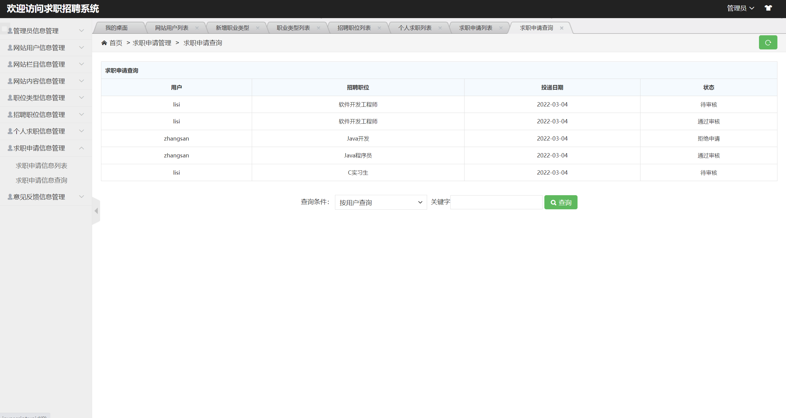

## 基于SSM框架的求职招聘系统

###  获取sql数据库文件: 从戎源码网 (https://armycodes.com/) QQ: 386869957 QQ群: 377586148
###  所有系统地址: (https://github.com/YuLin-Coder/AllProjectCatalog) 
###  所有项目以及源代码本人均调试运行无问题 可支持远程安装部署调试、定制修改、代码讲解

## 项目介绍
基于SSM框架的求职招聘系统，本系统分别为前台求职招聘和后台系统管理，功能如下：
1.前台求职招聘
前台首页、用户注册、用户登录、新闻公告、求职须知、求职信息、发布招聘信息、申请职位、个人中心、发布招聘信息、发布求职信息、求职申请、我的求职、意见反馈等功能。
2.后台系统管理
系统后台登陆、管理员管理、用户管理、新闻公告管理、职位类型管理、招聘职位管理、个人求职管理、求职申请管理、意见反馈管理等功能。

## 项目技术
- 编程语言：Java
- 数据库：MySQL
- 前端技术：JSP、jQuery 、H-ui
- 后端技术：Spring、SpringMVC、MyBatis

## 运行环境
- JDK版本：JDK1.8及以上
- 开发工具：IDEA、Ecplise、Myecplise都可以
- 数据库: MySQL5.7及以上

## 运行截图

