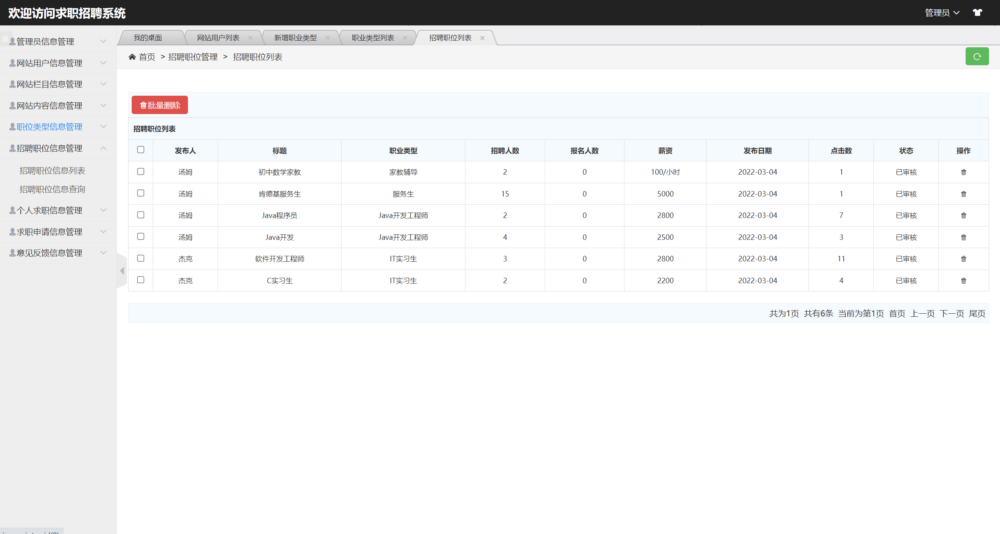

## 基于SSM框架的求职招聘系统

- <b>完整代码获取地址：从戎源码网 ([https://armycodes.com/](https://armycodes.com/))</b>
- <b>技术探讨、资料分享，请加QQ群：692619798</b> 
- <b>作者微信：19941326836  QQ：952045282</b> 
- <b>承接计算机毕业设计、Java毕业设计、Python毕业设计、深度学习、机器学习</b>
- <b>选题+开题报告+任务书+程序定制+安装调试+论文+答辩ppt 一条龙服务</b>
- <b>所有选题地址 ([https://github.com/YuLin-Coder/AllProjectCatalog](https://github.com/YuLin-Coder/AllProjectCatalog)) </b>

## 项目介绍
基于SSM框架的求职招聘系统，本系统分别为前台求职招聘和后台系统管理，功能如下：
1.前台求职招聘
前台首页、用户注册、用户登录、新闻公告、求职须知、求职信息、发布招聘信息、申请职位、个人中心、发布招聘信息、发布求职信息、求职申请、我的求职、意见反馈等功能。
2.后台系统管理
系统后台登陆、管理员管理、用户管理、新闻公告管理、职位类型管理、招聘职位管理、个人求职管理、求职申请管理、意见反馈管理等功能。

## 项目技术
- 编程语言：Java
- 数据库：MySQL
- 前端技术：JSP、jQuery 、H-ui
- 后端技术：Spring、SpringMVC、MyBatis

## 运行环境
- JDK版本：JDK1.8及以上
- 开发工具：IDEA、Ecplise、Myecplise都可以
- 数据库: MySQL5.7及以上

## 运行截图

